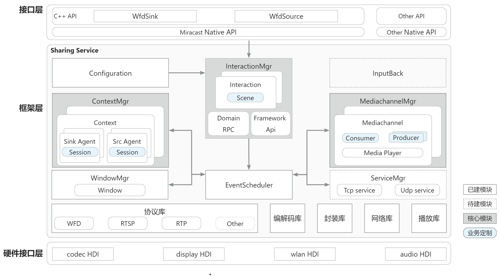

# castengine_wifi_display<a name="ZH-CN_TOPIC_0000001147574647"></a>
- [Introduction](#e05dce83)
- [Logical architecture](#x5H5N)
- [Module responsibilities](#b4Dwq)
- [directory structure](#767fa455)
- [Usage](#S3D8i)
- [Related Repositories](#55ac5bcd)

## Introduction <a name="e05dce83"></a>
The alias of the "castengine_wifi_display" component is "Sharing", which means "media sharing". This component has the capabilities of streaming media protocol access, media preview, and media redistribution. It is managed and called by the castengine_cast_framework service, and is an important streaming media capability component in the castengine subsystem. It provides simple Native C++ interfaces to support Miracast casting. The component provides the following common functions:

- WFD Source : Indicates the screen capture transmitter, which sends multiple screen data streams to different devices.

- WFD Sink: Indicates the screen data receiver, which receives screen data streams from multiple devices.
## Logical architecture <a name="x5H5N"></a>

## Module responsibilities <a name="b4Dwq"></a>
| **Module Name** | **Responsibilities** |
| --- | --- |
| Interaction | Framework layer interaction module, responsible for interaction between processes on the device or across devices,supporting concurrent interaction with multiple processes. |
| Scene | The business implementation part of the Interaction module, together with the Interaction instance, accomplishes external interactions and internal framework calls. |
| ContextMgr | The service context managerment of the framework. The container associates different agents to implement receiving, distributing, and sending media streams. Each context instance can contain multiple agents. |
| Agent | The agent object of the service in the framework, responsible for the interaction in the signaling. The Agent is divided into Sink Agent and Source Agent. Sink Agent is responsible for receiving stream (acquiring media data), and Source Agent is responsible for sending stream (outputting media data). |
| Session | The specific implementation of the service control and works with Agent to complete the signaling interactions of the service. |
| Configuration | Configuration management module that sets up configuration data for the framework and the service, which is loaded when the service starts. |
| EventScheduler | Event distribution and scheduling manager, centralized distribution and processing of events reported by the module, using asynchronous thread pool processing, not to deal with time-consuming operations such as disk IO and network IO. |
| MediachannelMgr | The framework media channel module manages media channels, and each media channel instance can realize the access, preview and sending of media data; it has the ability of coding and decoding, mixing, and transmitting of streaming media packets. |
| Consumer | Media data input object. The media data can be obtained in any way based on the business properties, usually used for receiving streams. |
| Producer | Media data output object. The  media data can be output in any way based on business properties, usually used for pushing streams. |
| ServiceMgr | Service management module, management for service monitoring. Each instance is used to monitor the specified tcp or udp port, and exchange data with external processes or devices. |
| InputBack | Inputback control module, handles cross-device control and coordinate changes. |
| WindowMgr | Window management. Window instances are used when preview Windows are internal triggered. |
| Protocol | Encapsulates protocols such as rtsp, rtp, wfd, dlna, and uibc for protocol interaction and interconnection. |
| Codec | Media data encapsulation and decapsulation, encoding and decoding, hardware decoding acceleration, etc. |
| Network | Encapsulates the network protocol, including the tcp/udp server and client. |

## Directory structure <a name="767fa455"></a>
Repositories directory structure is as follows:

```
/foundation/CastEngine/castengine_wifi_display # airing parts business code
├── figures                               #
├── interfaces                            # External interface
│   ├── kits                              # Application interface
│   └── innerkits                         # System internals interface
├── frameworks                            # Client implementation
│   └── innerkitsimpl                     # Native c++ implementation
├── sa_profile                            # Component configuration
├── services                              # Service C/S implementation
│   ├── interaction                       # Process interaction
│   ├── configure                         # Configuration management
│   ├── context                           # Business container
│   ├── agent                             # Service agent
│   ├── mediachannel                      # Media channel
│   ├── mediaplayer                       # Play and render
│   ├── etc                               # Inner service configuration
│   ├── event                             # Event center
│   ├── impl                              # Business implementation
│   │   └── wfd                           # WFD service implementation
│   ├── inputback                         # Anti-control module
│   ├── scheduler                         # Scheduling center
│   ├── windowmgr                         # Window management
│   ├── protocol                          # Protocol library
│   ├── codec                             # Codec library
│   ├── network                           # Network library
│   ├── extend                            # Third-party library
│   ├── common                            # Public classes
│   └── utils                             # Tools classes
├── sa_profile                            # Service configuration in system
├── tests                                 # Test cases
├── bundle.json                           # Component description file
└── BUILD.gn                              # Compilation entry
```


## Usage <a name="S3D8i"></a>
The WFD Sink allows multiple devices to cast it simultaneously. The castengine_wifi_display allows individual control of the audio for each casting session, enabling the selection of audio playback or muting in multi-casting scenarios. In general, the WFD Source can only cast to one device at a time. A device can act as a Sink or a Source, but not both simultaneously.

##  Related Repositories <a name="55ac5bcd"></a>

[castengine_cast_framework](https://gitee.com/openharmony/castengine_cast_framework)

[castengine_cast_plus_stream](https://gitee.com/openharmony-sig/castengine_cast_plus_stream)

[castengine_dlna](https://gitee.com/openharmony-sig/castengine_dlna)