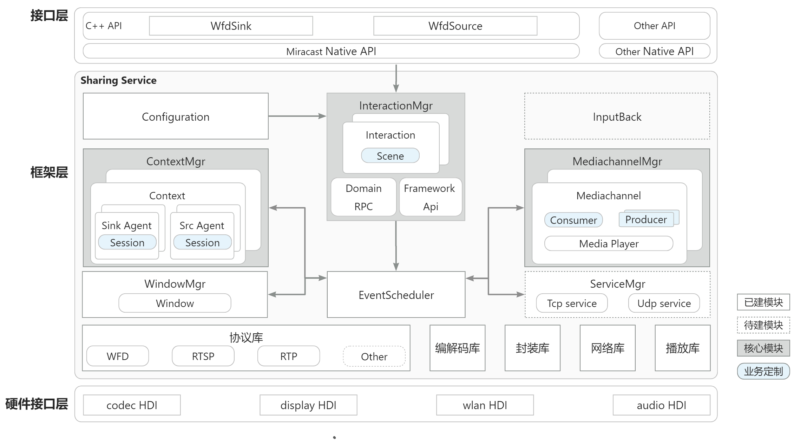

# castengine_wifi_display<a name="ZH-CN_TOPIC_0000001147574647"></a>
- [简介](#e05dce83)
- [逻辑架构](#x5H5N)
- [模块职责](#b4Dwq)
- [目录结构](#767fa455)
- [使用说明](#S3D8i)
- [相关仓](#55ac5bcd)

## 简介<a name="e05dce83"></a>
castengine_wifi_display部件别名Sharing，媒体分享之意。拥有流媒体协议接入、媒体预览、媒体转分发能力，受投播管理服务管理和调用，是音视频投播子系统重要的流媒体能力部件。提供一套简单的Native C++的接口，主要业务是Miracast投屏，提供以下常用功能：

- 主投端（WFD Source）：主投端发送器，用于投屏Source端业务，可发送多路屏幕镜像流到不同设备。

- 被投端（WFD Sink）：被投端接收器，用于投屏Sink端业务，可接收多个设备的投屏流。
## 逻辑架构<a name="x5H5N"></a>

## 模块职责<a name="b4Dwq"></a>
| **模块名称** | **职责** |
| --- | --- |
| Interaction | 框架层交互模块，负责与外部进程进行交互，基于IPC与RPC机制用于实现设备内和设备间的跨进程通信，支持与多个进程并发交互。 |
| Scene | 交互模块的业务实现部分，和Interaction实例共同完成对外交互和对内框架调用。 |
| ContextMgr | 框架层业务容器模块，负责将不同的业务Agent关联在一起，用于实现收流，转发，发流等业务；每个业务容器实例可包含多个Agent。 |
| Agent | 业务在框架层的代理对象，负责信令层的交互。Agent分为Sink端Agent和Src端Agent。其中，Sink Agent负责收流（获取媒体数据）业务，Src Agent负责发流（输出媒体数据）业务。 |
| Session | 业务控制层的具体实现，和Agent对象共同完成业务的信令交互。 |
| Configuration | 配置管理模块，设置框架和业务的配置数据，服务启动时加载。 |
| EventScheduler | 事件分发调度管理器，集中分发处理模块上报事件，采用异步线程池方式处理，不处理磁盘IO和网络IO等耗时操作。 |
| MediachannelMgr | 框架层媒体通道模块，管理媒体通道，每个媒体通道实例可实现媒体数据的接入、预览和发送；具备编解码能力、混流能力、流媒体数据包透传能力； |
| Consumer | 获取媒体数据对象，可根据业务属性通过任何方式获取媒体数据，通常用于收流。 |
| Producer | 输出媒体数据对象，可根据业务属性通过任何方式输出媒体数据，通常用于推流。 |
| ServiceMgr | 框架层服务管理模块,服务监听的管理模块，每个service实例用于对指定的端口进行tcp或者udp监听，可与外部进程或设备进行数据交互。 |
| InputBack | 反控模块，跨设备反控及坐标变化等处理。 |
| WindowMgr | 框架层窗口管理模块，窗口实例用于自触发预览窗口时使用。 |
| Protocol | 实现rtsp、rtp、wfd、dlna、uibc等协议封装，用于对外协议交互与对接。 |
| Codec | 媒体数据的封装与解封装，编码与解码，硬解加速等。 |
| Network | 网络协议封装，包括tcp/udp的服务端、客户端等。 |

## 目录结构<a name="767fa455"></a>
仓目录结构如下：
```
/foundation/CastEngine/castengine_wifi_display  # 投播部件业务代码
├── figures                               # 
├── interfaces                            # 外部接口层
│   ├── kits                              # 应用接口
│   └── innerkits                         # 系统内部件接口
├── frameworks                            # 部件无独立进程的实现
│   └── innerkitsimpl                     # native c++实现
├── sa_profile                            # 部件配置
├── services                              # 服务C/S实现
│   ├── interaction                       # 进程交互
│   ├── configure                         # 配置管理
│   ├── context                           # 业务容器
│   ├── agent                             # 业务代理
│   ├── mediachannel                      # 媒体通道
│   ├── mediaplayer                       # 播放渲染
│   ├── etc                               # 部件进程配置
│   ├── event                             # 事件中心
│   ├── impl                              # 业务实现
│   │   └── wfd                           # WFD业务实现
│   ├── inputback                         # 反控模块
│   ├── scheduler                         # 调度中心
│   ├── windowmgr                         # 窗口管理
│   ├── protocol                          # 协议库
│   ├── codec                             # 编解码库
│   ├── network                           # 网络库
│   ├── extend                            # 引入库
│   ├── common                            # 公共类
│   └── utils                             # 工具类
├── sa_profile                            # 服务配置                        
├── tests                                 # 测试代码
├── bundle.json                           # 部件描述文件
└── BUILD.gn                              # 编译入口
```
## 目录结构<a name="S3D8i"></a>
WFD Sink作为被投端允许多个设备同时投屏。投播框架允许单独操控每路投屏的音频，因此在多路投屏时可自由选择音频的播放与静音；WFD Source 可投屏到多个Sink端。设备作为Sink端时不能再作为Source端，反之亦然。

## 相关仓<a name="55ac5bcd"></a>
[castengine_cast_framework](https://gitee.com/openharmony/castengine_cast_framework)

[castengine_cast_plus_stream](https://gitee.com/openharmony-sig/castengine_cast_plus_stream)

[castengine_dlna](https://gitee.com/openharmony-sig/castengine_dlna)
